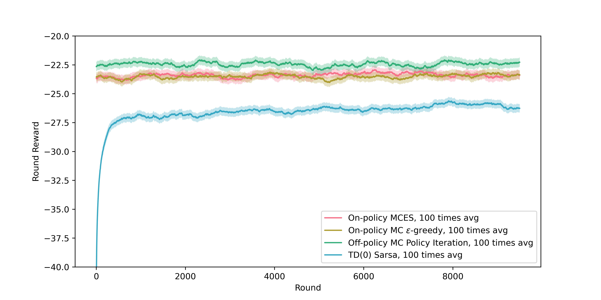

# 代码组成
1. `mc.py` 主实验代码。每轮进行10K轮(episode)随机游走，100轮结果取平均。
2. `utils.py` 提供四种MC/TD(0)算法实现. 分别是MCES法, $\varepsilon$-greedy的On-Policy MC法, Off-Policy的MC法策略迭代(采用$\varepsilon$-greedy探索策略),和On-Policy Sarsa法(采用$\varepsilon$-greedy策略).

# 实验结果

实验结果如上图。可以看到, 带重要度采样的Off-Policy MC法优于两种On-Policy MC法, 优于Sarsa.