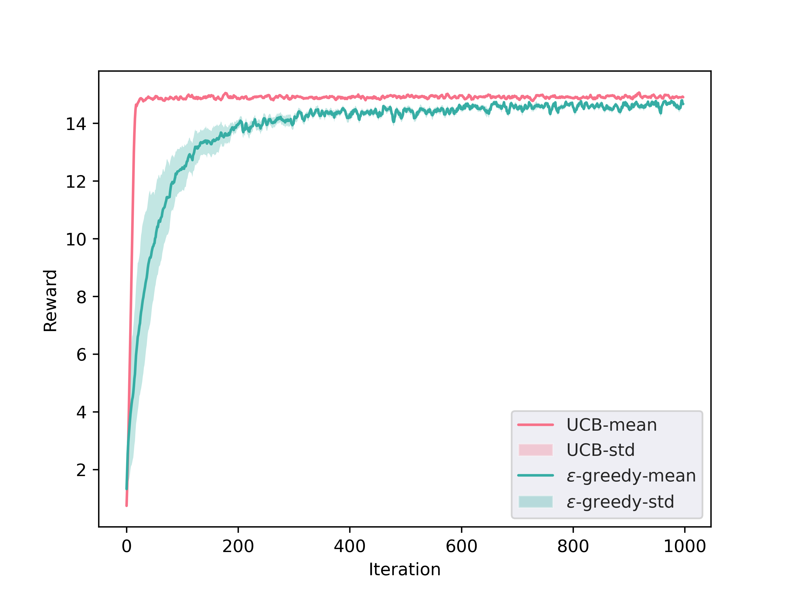

# 代码组成
1. `multiarm_slot.py` 提供多臂老虎机随机数生成器。提供记录工具与滑动窗口平均计算工具方法。
2. `e_greedy.py` 提供$\varepsilon$-greedy算法实现与重复实验。实验数据记录在`e_greedy.json`中。其中实验重复100轮，每轮实验进行1000次迭代，$\varepsilon=0.05$。
3. `ucb.py` 提供UCB算法实现与重复实验。实验数据记录在`ucb.json`中。其中实验重复100轮，每轮实验进行1000次迭代，$C=0.5$。
4. `plot_ucb_egreedy.py` 根据实验数据绘制reward-time图，并标出多次实验的均值和方差。图像保存于`compare.png`，均值-方差均使用窗口滑动平均（窗口大小=5）。
# 实验结果

实验结果如上图。可以看到，对于多臂老虎机问题，UCB算法比$\varepsilon$-greedy算法更快收敛到更优的决策上。